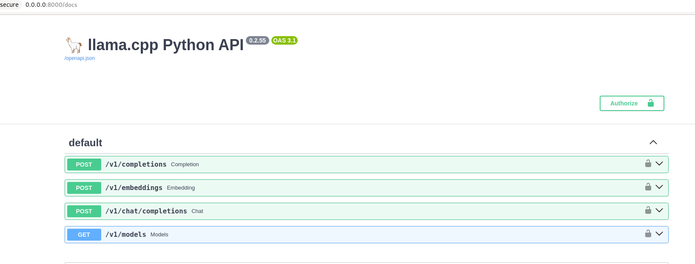
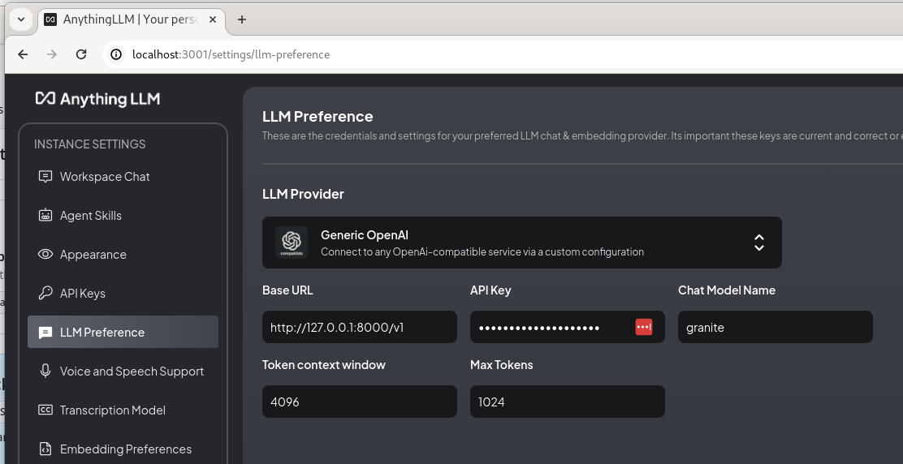
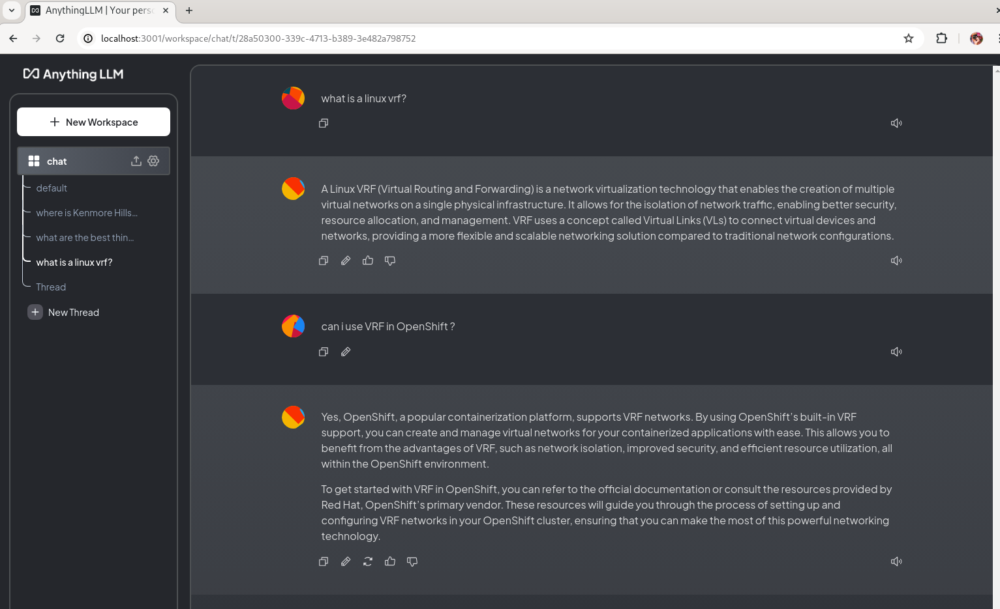

# anythingllm-podman-instructlab

To run a custom built instructlab in podman with anythingLLM:

- rootless podman
- set our groups correctly in the pod
- uses NVIDIA gpu device
- ilab pod uses a [llama-cpp build](https://github.com/eformat/sno-llama/tree/main/instructlab)

Run ilab:

```bash
podman run \
  --userns keep-id 
  --annotation run.oci.keep_original_groups=1 \
  --name ilab \
  --rm -it --entrypoint=bash \
  --device nvidia.com/gpu=0 \
  --security-opt label=type:nvidia_container_t \
  -v /home/mike/instructlab:/opt/app-root/src/instructlab \
  -v /home/mike/.cache/huggingface:/opt/app-root/src/.cache/huggingface \
  --net=host \
  quay.io/eformat/ilab-mike:latest
```

then run:

```bash
cd instructlab/
ilab serve
```

using config:

```yaml
chat:
  context: default
  greedy_mode: false
  logs_dir: data/chatlogs
  model: models/granite-7b-lab-Q4_K_M.gguf
  session: null
  vi_mode: false
  visible_overflow: true
general:
  log_level: INFO
generate:
  chunk_word_count: 1000
  model: models/granite-7b-lab-Q4_K_M.gguf
  num_cpus: 10
  num_instructions: 100
  output_dir: generated
  prompt_file: prompt.txt
  seed_file: seed_tasks.json
  taxonomy_base: origin/main
  taxonomy_path: taxonomy
serve:
  gpu_layers: -1
  host_port: 0.0.0.0:8000
  max_ctx_size: 4096
  model_path: models/granite-7b-lab-Q4_K_M.gguf
```

Browse to `http://0.0.0.0:8000/docs`



Use [anythingLLM](https://useanything.com/download) as Chat UI

```bash
podman pull mintplexlabs/anythingllm

export STORAGE_LOCATION=$HOME/tmp/anythingllm && \
mkdir -p $STORAGE_LOCATION && \
touch "$STORAGE_LOCATION/.env"

podman run \
 -v ${STORAGE_LOCATION}:/app/server/storage:z \
 -v ${STORAGE_LOCATION}/.env:/app/server/.env:z \
 -e STORAGE_DIR="/app/server/storage" \
 --net=host \
 mintplexlabs/anythingllm
```

Browse to `http://localhost:3001/`

Setup local serving:



🤓🤓 CHAT !!


